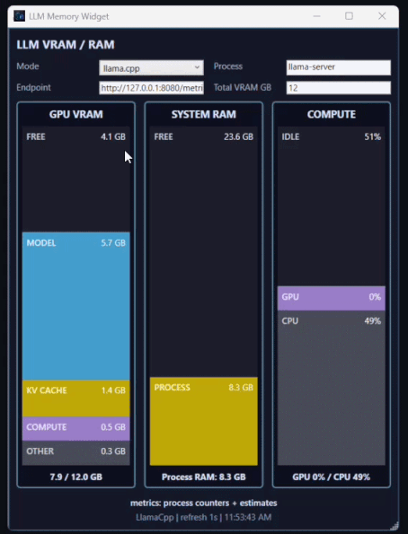

<p align="center">
  
</p>

<h1 align="center">LLM Memory Widget</h1>

<p align="center">
  A sleek Windows desktop widget for monitoring local LLM GPU VRAM, system RAM, and compute usage in realtime.
</p>

<p align="center">
  
  
  
  
  
  
</p>

---

## Summary

**LLM Memory Widget** is a compact, always-on-top Windows monitoring tool built for tuning local LLM runtimes like **LM Studio** and **llama.cpp**. It gives a cleaner, model-focused view than Task Manager by separating local model usage into dedicated columns for **GPU VRAM**, **System RAM**, and **Compute**.

The widget tracks realtime process-level GPU and CPU activity, reads dedicated GPU memory from Windows performance counters, and can optionally parse llama.cpp `/metrics` output for model, KV cache, compute, and other runtime memory details. It also supports a focused column mode, custom app icon, and MSI installer packaging for easy local installation.

## Features

* Realtime 1-second refresh
* LM Studio and llama.cpp modes
* Automatic process defaults when switching modes
* Dedicated GPU memory per process
* System RAM usage estimate
* GPU and CPU utilization
* llama.cpp `/metrics` support
* Attempts to parse model, KV cache, compute, and other VRAM metrics when exposed
* Three-column layout:

  * GPU VRAM
  * System RAM
  * Compute
* Double-click any column to focus it as the only visible column
* Double-click again to return to the three-column view
* Normal Windows title bar
* Custom application icon
* MSI installer support through WiX

## Layout

The main widget is split into three columns.

### GPU VRAM

Shows the selected process's dedicated GPU memory split into:

* Model
* KV Cache
* Compute
* Other
* Free

When exact values are not available from an endpoint, the widget falls back to Windows GPU process counters and estimates the split.

### System RAM

Shows an estimate of process RAM that appears to remain outside dedicated GPU VRAM.

The approximation is:

```text
Process Working Set - Dedicated GPU Memory
```

This is not a perfect accounting model because Windows working set and GPU memory are tracked differently, but it is useful for seeing whether a local model is spilling heavily into system RAM.

### Compute

Shows realtime activity:

* GPU utilization for the selected process
* CPU utilization for the selected process
* Idle percentage

Dedicated VRAM can remain fairly static while inference is active because memory is usually allocated when the model loads. The compute column is usually the better indicator of active prompt ingestion or token generation.

## Requirements

* Windows 10/11
* .NET 8 SDK for development/building
* Windows GPU performance counters enabled
* Optional: llama.cpp started with `--metrics`

For MSI generation:

* WiX Toolset SDK package is referenced by the installer project
* Internet access may be needed the first time NuGet restores WiX packages

## Quick Start

From the project root:

```powershell
dotnet run
```

To build the app:

```powershell
dotnet build
```

To publish a self-contained executable:

```powershell
dotnet publish -c Release -r win-x64 --self-contained true -p:PublishSingleFile=true
```

## Settings

### LM Studio

Use these values:

```text
Mode: LM Studio
Process: LM Studio
Endpoint: blank unless you have a stats endpoint
Total VRAM GB: your GPU VRAM amount, for example 12
```

When `Mode` is changed to `LM Studio`, the app automatically sets:

```text
Process: LM Studio
Endpoint: blank
```

### llama.cpp

Use these values:

```text
Mode: llama.cpp
Process: llama-server
Endpoint: http://127.0.0.1:8080/metrics
Total VRAM GB: your GPU VRAM amount, for example 12
```

When `Mode` is changed to `llama.cpp`, the app automatically sets:

```text
Process: llama-server
Endpoint: http://127.0.0.1:8080/metrics
```

If your `llama-server` runs on a different port, update the endpoint manually.

Example llama.cpp launch command:

```powershell
llama-server `
  -m "C:\path\to\model.gguf" `
  --host 127.0.0.1 `
  --port 8080 `
  --metrics
```

If you use port `8001`, set the widget endpoint to:

```text
http://127.0.0.1:8001/metrics
```

## Process Names

The widget monitors by Windows process name.

Common values:

```text
LM Studio
llama-server
llama-cli
llama-run
```

Use Task Manager or PowerShell to confirm the exact process name:

```powershell
Get-Process | Where-Object { $_.ProcessName -like "*llama*" }
```

## Metric Sources

The widget uses multiple data sources depending on what is available.

### Windows Counters

Dedicated GPU memory:

```text
GPU Process Memory
Dedicated Usage
```

GPU utilization:

```text
GPU Engine
Utilization Percentage
```

Process RAM:

```text
Process.WorkingSet64
```

Process CPU:

```text
Process.TotalProcessorTime
```

System RAM:

```text
GlobalMemoryStatusEx
```

The project intentionally avoids `Microsoft.VisualBasic.Devices.ComputerInfo` and uses `GlobalMemoryStatusEx` through `DllImport` instead.

### llama.cpp Metrics

When a `/metrics` endpoint is configured, the widget attempts to parse Prometheus-style metrics for:

* model VRAM
* KV cache VRAM
* compute/workspace VRAM
* other/scratch/buffer VRAM
* RAM/host memory
* KV cache used cells
* KV cache total cells

Exact metric names can vary between llama.cpp builds, so the parser searches for likely memory-related metric names instead of depending on only one exact name.

### LM Studio Metrics

LM Studio does not consistently expose a detailed model/KV/compute VRAM breakdown through its OpenAI-compatible API.

For LM Studio, the widget primarily uses Windows process counters unless you provide an endpoint that exposes JSON or Prometheus-style metrics. If an endpoint is supplied, the parser scans for numeric fields related to:

* model
* KV cache
* compute
* VRAM
* GPU memory
* RAM
* host memory

## Fallback Estimates

When exact model/KV/compute metrics are unavailable, the app estimates the dedicated GPU memory breakdown as:

```text
Model:    72%
KV Cache: 18%
Compute:   6%
Other:     4%
```

If KV cache used/total cells are available, the KV cache row is adjusted based on the reported KV usage ratio.

The numeric display stays accurate to the available data, while the visual rows keep a minimum height so labels such as `KV CACHE`, `COMPUTE`, and `OTHER` remain visible even when the value is `0.0 GB`.

## Column Focus Mode

Double-click any main column to focus it.

```text
Double-click GPU VRAM   -> GPU VRAM only
Double-click SYSTEM RAM -> System RAM only
Double-click COMPUTE    -> Compute only
Double-click again      -> reset to three-column view
```

## Application Icon

The project includes a custom app icon:

```text
Assets/AppIcon.ico
Assets/AppIcon.png
```

The icon is wired into:

```xml
<ApplicationIcon>Assets\AppIcon.ico</ApplicationIcon>
```

and the WPF window:

```xml
Icon="Assets/AppIcon.ico"
```

This sets the icon for the EXE, title bar, and taskbar.

## Build the MSI Installer

The project includes a WiX-based MSI installer.

From the project root:

```powershell
.\Build-MSI.ps1
```

If PowerShell blocks unsigned scripts, use:

```cmd
Build-MSI.cmd
```

or run:

```powershell
powershell.exe -NoProfile -ExecutionPolicy Bypass -File .\Build-MSI.ps1
```

The MSI will be created at:

```text
artifacts\LLM-Memory-Widget-Setup-1.0.0.msi
```

Install with:

```powershell
msiexec /i ".\artifacts\LLM-Memory-Widget-Setup-1.0.0.msi"
```

Silent install:

```powershell
msiexec /i ".\artifacts\LLM-Memory-Widget-Setup-1.0.0.msi" /qn
```

The MSI installs to:

```text
C:\Program Files\LLM Memory Widget
```

It also creates:

* Start Menu shortcut
* Desktop shortcut

## Project Structure

```text
LlmMemoryWidget/
├─ Assets/
│  ├─ AppIcon.ico
│  └─ AppIcon.png
├─ Installer/
│  ├─ LlmMemoryWidget.Installer.wixproj
│  ├─ Package.wxs
│  └─ README.md
├─ Properties/
│  └─ PublishProfiles/
│     └─ FolderProfile.pubxml
├─ App.xaml
├─ App.xaml.cs
├─ Build-MSI.cmd
├─ Build-MSI.ps1
├─ GpuProcessMemoryReader.cs
├─ Install-MSI.cmd
├─ Install-MSI.ps1
├─ LlmMemoryWidget.csproj
├─ LlmMetricsParser.cs
├─ MainWindow.xaml
├─ MainWindow.xaml.cs
├─ README.md
└─ SystemMemoryReader.cs
```

## Troubleshooting

### PowerShell says the script is not digitally signed

Use the included CMD wrapper:

```cmd
Build-MSI.cmd
```

Or run:

```powershell
powershell.exe -NoProfile -ExecutionPolicy Bypass -File .\Build-MSI.ps1
```

This bypass is process-only and does not permanently change the machine execution policy.

### `ProcessNameBox` is null during startup

The app guards mode-switching logic until the WPF window is loaded. If you modified the XAML event wiring, ensure `SettingsChanged` checks `IsLoaded` before accessing named controls.

### GPU memory does not change during generation

That is expected in many cases. Local LLM runtimes often allocate VRAM when the model loads. During active generation, watch:

* GPU utilization
* CPU utilization
* llama.cpp prompt/generation metrics if available

### Dedicated GPU memory is unavailable

Windows GPU performance counters may not expose data on every system, driver, or GPU backend. The app falls back to process working set RAM estimates when needed.

### llama.cpp metrics endpoint is empty or unavailable

Confirm that llama.cpp was started with `--metrics` and that the port matches the endpoint in the widget.

Example:

```powershell
curl http://127.0.0.1:8080/metrics
```

### WiX ICE80 / x64 errors

The installer project sets x64 in the WiX project file:

```xml
<InstallerPlatform>x64</InstallerPlatform>
<Platform>x64</Platform>
```

Do not add `Platform="x64"` directly to the WiX `<Package>` element. WiX v5 does not accept that attribute there.

## Notes and Limitations

This tool is meant for practical local-model tuning, not perfect low-level memory accounting.

Some values are exact when Windows counters or runtime metrics expose them. Other values are best-effort estimates because LM Studio and llama.cpp do not always expose detailed model/KV/compute memory breakdowns through stable external APIs.

For best results with llama.cpp, enable `/metrics` and set the widget endpoint to the correct port.
